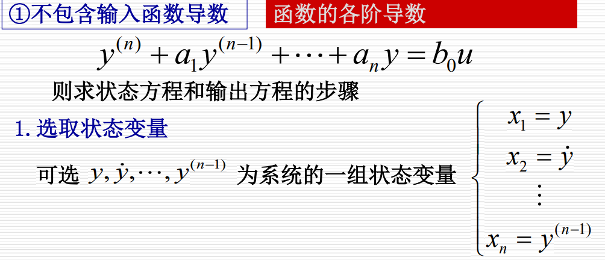
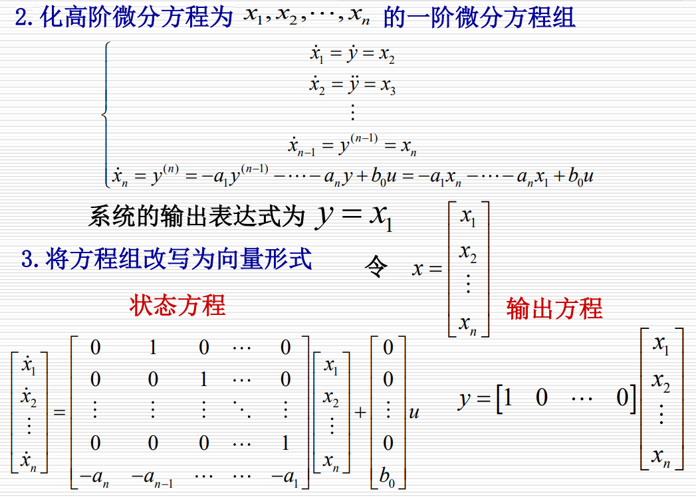
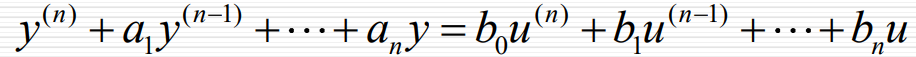
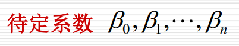
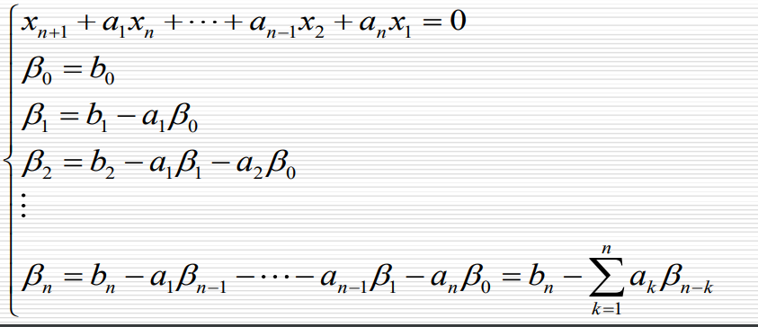
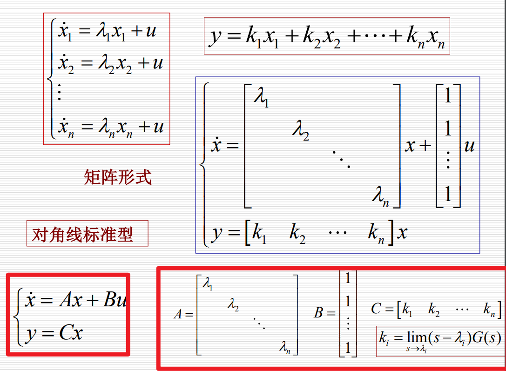
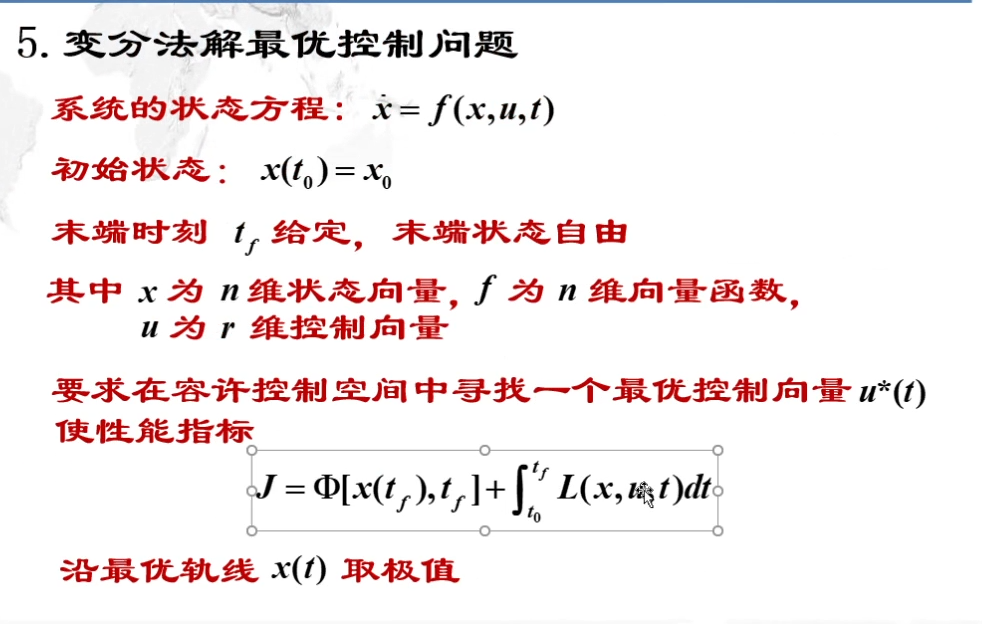

# 理解

> 包含输入函数导数

$\beta$ 满足

特征根只有单重根
传递函数变为

最终结果

特征根为多个重根和单重根

# 背

系数矩阵的名字

强迫运动状态变量解的一般形式

需要知道解各个部分的物理含义

运动分析的方法和特点
> 运动分析的常用方法有两种: 
>1. `迭代法` 适用范围较大,离散点
>2. `Z变换法` 定常系统,能得到解析解

连续系统的离散化的三个基本假设
> 1. 采样器的采样方式是以常数tao为采样周期的`等间隔采样`
> 2. 保持器采用`零阶保持器`
> 3. 采样周期的选择要满足`香农采样定理`

近似离散化
> 1. 由于线性时变连续系统状态方程的状态转移矩阵一般情况不能写成闭式，因此这里介绍一种近似方法: 在采样周期T较小、且对其精度要求不高时，通过近似离散化，可以把它变成线性离散状态方程，以便求出它的近似解，即在采样时刻的近似值
> 2. 近似离散化时采样周期T愈小，其近似精度越高。

李亚普诺夫第二方法
> 李亚普诺夫第二方法称为`直接法`，基本思想是用`能量变化的观点`分析系统的稳定性 。

稳定与渐进稳定的定义
> 
> 

卡尔曼滤波器的两个重要假设
>1.被建模的系统是`线性`的：K时刻的系统状态可以用某个矩阵与K-1时刻的系统状态的乘积表示。
> 2.影响测量的噪声属于`高斯分布的白噪声`：噪声与时间不相关，且只用均值和协方差（也就是噪声完全由一阶距和二阶距描述）就可以准确地为幅值建模。

卡尔曼滤波五个方程各参数意义

变分法最优控制

哈密顿函数

哈密顿函数的H和性能指标的J之间的关系

动态规划的三个定义

