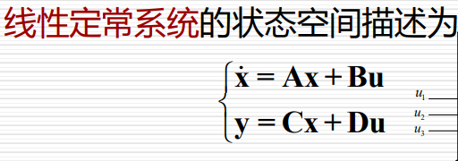
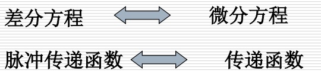
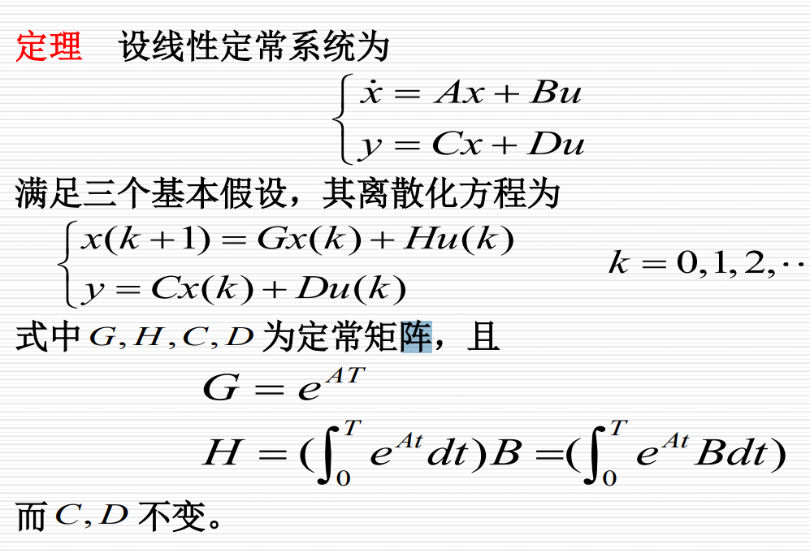
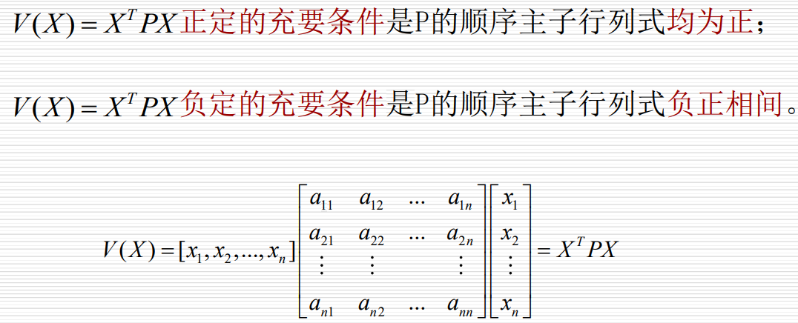
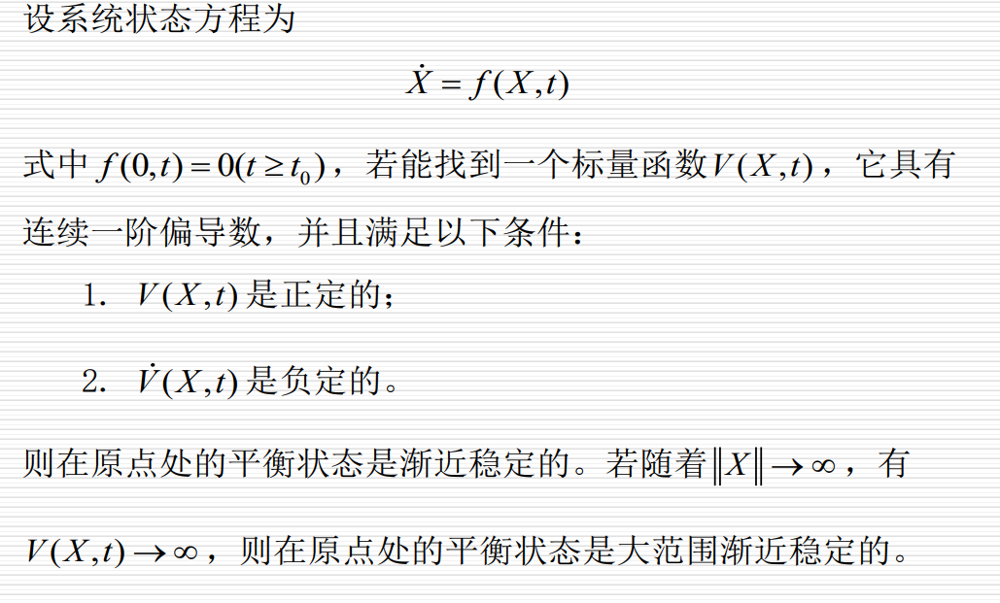
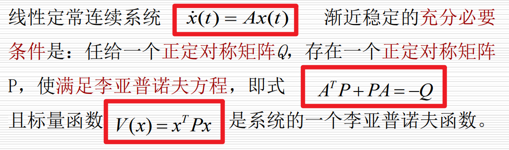
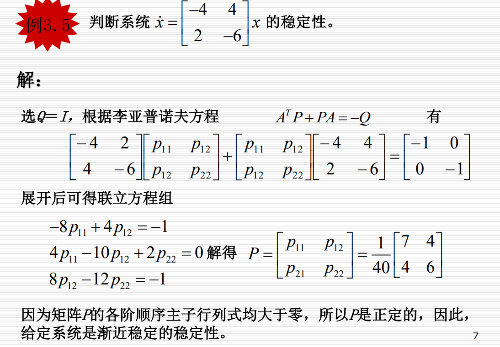

现代控制理论 
11月8日 13:00-15:00 正心22

source: 考点.pdf
1. 动态规划 算 给公式
2. 线性二次项每一项有什么用 `概念`
3. 输出调节器 输出跟踪 `概念`
4. 最大值原理 算 给公式
5. 变分法 无推导 `只有欧拉方程` 无计算 `概念` ??
6. 卡尔曼滤波 概念 方程每一次的意思
7. 状态反馈 状态观测 `计算`
8. 能观性 能控行 `简单计算`
9. 稳定性分析 计算 
10. 运动分析
11. 状态空间

[toc]

# 状态空间表达式
## 物理模型到状态空间

上面的是`状态方程`
下面的是`输出方程`
背
> 系数矩阵的名字

> 例1 物理模型写状态空间表达式

## 时域描述转为状态空间
对于单输入单输出的线性定常系统

### 不包含输入函数导数

> 例2 不包含输入函数导数将时域写为状态空间

### 包含输入函数导数

$\beta$ 满足

> 例3 包含输入函数导数将时域写为状态空间

## 频域描述转为状态空间
对于单输入单输出的线性定常系统

### 特征根只有单重根
传递函数变为

最终结果

> 例4 单重特征根频域写为状态空间

### 特征根只有一个r重根
传递函数变为

最终结果

其中k为

> 例5 单个r重根频域写为状态空间

### 特征根为多个重根和单重根

## 将状态方程的化简
化简的是状态方程 而不是状态空间

> 例6 任意矩阵化为对角线标准型
对A进行相似对角化操作,求得A的对角矩阵为相似对角阵: 求A的特征值 特征向量
对B进行 的操作

> 例7 将状态方程化为约旦标准型
> 对A操作就是相似对角化的操作

# 运动分析
线性定常系统状态方程

在自由运动 $u=0$ 时的解为

I是单位矩阵,且满足

即为

## 计算惯性指数
1. 
2. 
3. 化为对角线法
4. 约旦标准型法(SB)
5. 多项式法(SB)

> 例8 定义法解惯性指数
> 

> 例9 拉氏变换求惯性指数
> 重点 公式不用记
> 

> 例10 对角线化简求惯性指数
> 

## 强迫运动状态变量解的一般形式

需要知道解各个部分的物理含义
> 例11 求解状态方程-1
> 直接套公式
> 

> 例12 求解状态方程-2
> SB
> 

## 离散系统的运动分析
生活中大部分是离散系统

### 差分方程转为状态空间
了解一下???
### 将脉冲传递函数转化为状态空间描述
了解一下???
### 运动分析的方法
背
> 运动分析的常用方法有两种: 
1. `迭代法` 适用范围较大,离散点
2. `Z变换法` 定常系统,能得到解析解

了解 
> z变换法的大致过程
> ?

###　连续系统的离散化
背
> 背: 连续系统的离散化的三个基本假设
> 1. 采样器的采样方式是以常数tao为采样周期的`等间隔采样`
> 2. 保持器采用`零阶保持器`
> 3. 采样周期的选择要满足`香农采样定理`

了解
> 离散化后系数矩阵有什么样的变化
> 

背
> 1. 由于线性时变连续系统状态方程的状态转移矩阵一般情况不能写成闭式，因此这里介绍一种近似方法: 在采样周期T较小、且对其精度要求不高时，通过近似离散化，可以把它变成线性离散状态方程，以便求出它的近似解，即在采样时刻的近似值
> 2. 近似离散化时采样周期T愈小，其近似精度越高。

# 稳定性分析
## 李亚普诺夫第二方法
背
> 李亚普诺夫第二方法称为`直接法`，基本思想是用`能量变化的观点`分析系统的稳定性 。
## 二次型V正定负定的虫咬条件:Sylvester准则

## 稳定, 渐进稳定的定义,看图
背
> 稳定与渐进稳定的定义
> 
> 

## 李雅普诺夫基本定理

## 李雅普诺夫方程

定理中Q为任意正定对称矩阵，为方便，常取Q=I(单位对角阵)

计算: 很重要
> 例13 李亚普诺夫方程判定线性定常系统稳定性-1
> 

> 例14 李亚普诺夫方程判定线性定常系统稳定性-2
> 