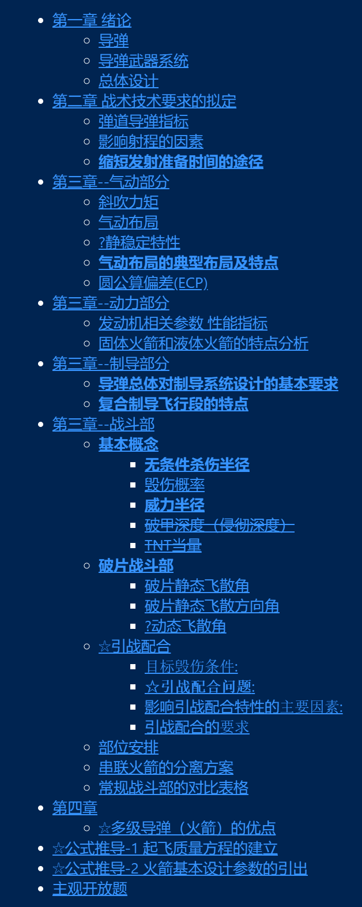

导弹及运载火箭总体设计 

AS32448 

2022年11月23日(第15周 星期三)10:00-12:00  

正心14   

# 考试范围
1-4章ppt以内 英文部分不考 
# 考试题型
|题号|题型|数量|单价|合计|
|-|-|-|-|-|
|1|名词解释|5|2|10
|2|填空|20|0.5|10
|3|简答|8|5|40
|4|公式推导|2|10|20
|5|开放题|1|20|20
|合计||||100

填空有8个小题 简答题是关键 不会也要写满

第四题 看清题
质量方程要标注每个符号的意义

第五题:
> 试思考多学科设计优化、隐身等先进技术对导弹总体设计结果有哪些提升；试讨论作战运用、作战效能对导弹总体设计的影响；试预测未来导弹的发展趋势。

# 大纲
