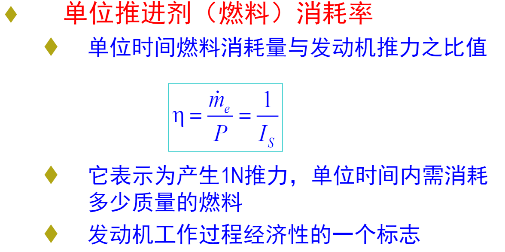

[toc]
# 第一章 绪论
## 导弹
是依靠喷气发动机推进的或做无动力飞行的一种无人驾驶的有控飞行武器
## 导弹武器系统
单独的导弹是不能完成作战任务的，必须有其它系统(或设备)与之配合，并通过一定的连接方式，构成一个完整的体系，才能完成武器的作战使命。
## 总体设计
针对大系统研制而言的技术抓总工作，通过总体设计可使大系统的研制工作任务指标明确，设计方案合理（优选方案），整个研制工作从无序到有序（各系统协调配合），最终使研制出的整体系统成本降低，周期缩短，技术性能最优（效费比最高）
1. 具有很强的背景性
2. 总体设计是一门大系统工程科学
3. 总体设计是一门综合性科学
4. 总体设计是一个从已知设计条件出发创造出新产品的过程

# 第二章 战术技术要求的拟定
## 弹道导弹指标
射程 命中精度及杀伤概率 生存能力 发射准备时间 火力机动范围 作战使用条件 首翻期、贮存期
## 影响射程的因素
1. 地球自转
2. 推进剂受环境温度影响
3. 逆、顺风
4. 发射点高程
5. 与作战使用条件有关
## 缩短发射准备时间的途径
1. 液体-->固体
2. 提高自动化水平
3. 简化发射状态检查及操作程序
4. 提高发射可靠性
5. 全备弹
6. 操作人员素质

# 第三章--气动部分
## 气动布局
导弹弹身上的外露部件（弹翼、舵面、进气道等）的形状、数目确定及其沿弹身周侧和轴向的布置。
## 气动力矩

## 静稳定特性

## 气动布局的典型布局及特点

# 第三章--动力部分
## 相关参数 性能指标
1. 推力
2. 总冲
3. 工作时间
4. 比冲:消耗1kg推进剂所产生的冲量
5. 发动机高度和速度特性
6. **单位推进剂（燃料）消耗率**

7. 质量比（固体发动机）: 推进剂质量/动力装置质量（含推进剂）
8. 单位迎面推力:
   1. 发动机推力与最大迎风面积之比
   2. 发动机阻力特性
   3. 对吸气式发动机尤为重要
   4. 从空气动力学角度反映出发动机设计的好坏

## 各类弹（箭）用发动机的特点分析

# 第三章--指导部分
## ???

## 导弹总体对制导系统设计的基本要求
战术技术指标直接影响制导系统的方案选择,确定及设计，但命中精度是核心问题
制导系统的根本任务：在尽量保证上述条件下，必须保证导弹的命中精度
1. 满足制导精度要求
2. 战术使用灵活
3. 尽可能减少设备的体积、质量及内耗
4. 成本适当
5. 可靠性高、可检测及维护性好

## 复合制导飞行段
|飞行段|定义|特点|
|-|-|-|
|初制导|飞行时间短 平均速度小 速度变化大|当导弹从发射到加速到正常飞行状态时，发射段弹道散布难以满足中制导要求时（一般指遥控、自寻的制导），要加初制导
|中制导|飞行时间长 飞行空域大|当导弹末制导对目标的截获与稳定跟踪距离及视场无法与导弹射程及作战空域的要求匹配，同时初制导有控弹道散布无法满足末制导启控条件，要采用中制导
|末制导|距离目标近 飞行距离短 需用过载大|综合考虑中制导的体制与能够达到的精度、导弹打击目标的精度要求（目标尺寸、要害、杀伤概率）及导弹成本，确定是否采用末制导

# 第三章--战斗部
## 参数
1. **无条件杀伤半径**
> 在某个半径范围内，冲击波能确定的摧毁目标
2. 毁伤概率
> 导弹正常发射并飞至预定攻击区域，引信正常工作条件下，战斗部毁伤目标的可能性
3. **威力半径**
> 对给定目标而言，毁伤概率达到规定值时，杀伤战斗部的破片飞散距离

## 破片战斗部
1. 原理: 高速飞散破片
2. 特点: 高空速度下降慢;杀伤范围大，需多个击中目标
3. 打击目标: 空中目标

## ☆引战配合
1. `目标毁伤条件`: 目标的要害部位恰好处于战斗部的破片飞散区
2. **`☆引战配合问题`**: 正确选择引信的起爆时机，使战斗部的实际引爆区与战斗部的有效起爆区协调配合
3. 影响引战配合特性的`主要因素`:
   1. 弹目遭遇条件：导弹、目标速度、姿态、交会角、遭遇高度
   2. 目标特性：要害部位尺寸、位置、分布，目标的质心位置、目标辐射、反射特性
   3. 战斗部参数：静态飞散角、飞散方向角、破片大小、质量、初速、密度
   4. 引信性能参数：引信灵敏度、时延、视场、感知距离
3. 引战配合的`要求`
   1. 引信实际引爆距离< 战斗部有效杀伤半径
   2. 引信实际引爆区与战斗部有效引爆区之间应协调(在弹目各种预期遭遇条件下，二者配合概率不小于给定值)
   3. 引信实际引爆区中心应力求接近战斗部的最佳起爆点，以获得最佳杀伤效果

## 部位安排
根据导弹（火箭）总体布局，合理安排弹（箭）上部件及仪器的相对位置，是总体设计中一项繁杂而细致的工作
## ???

# 第四章--一定有一道简答题
## 多级导弹（火箭）的优点
1. 多级导弹（火箭）在每级工作结束后可以抛掉不需要的质量，因而在导弹的飞行过程中，能够获得良好的加速性能，逐步达到预定的飞行速度。
2. 多级导弹（火箭）各级发动机是独立工作的，可以按照每一级的飞行条件设计发动机，使发动机处于最佳工作状态，也就提高了导弹的飞行性能。
3. 多级导弹（火箭）可以灵活地选择每一级推力的大小和工作时间，以适应飞行弹道的要求、弹道测量要求以及导弹对飞行过载的要求

## 级数对主要性能的影响--一些有意义的结论
???

# 计算题-1 起飞质量方程的建立
???
# 计算题-2 火箭基本设计参数的引出
???

# 开放题
> 试思考多学科设计优化、隐身等先进技术对导弹总体设计结果有哪些提升；试讨论作战运用、作战效能对导弹总体设计的影响；试预测未来导弹的发展趋势。

疯狂的写+结合实事