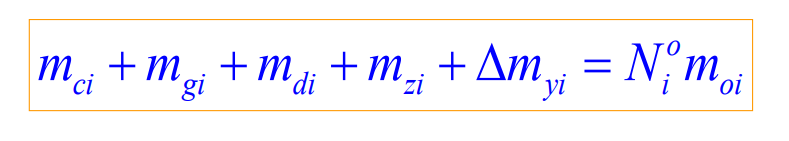
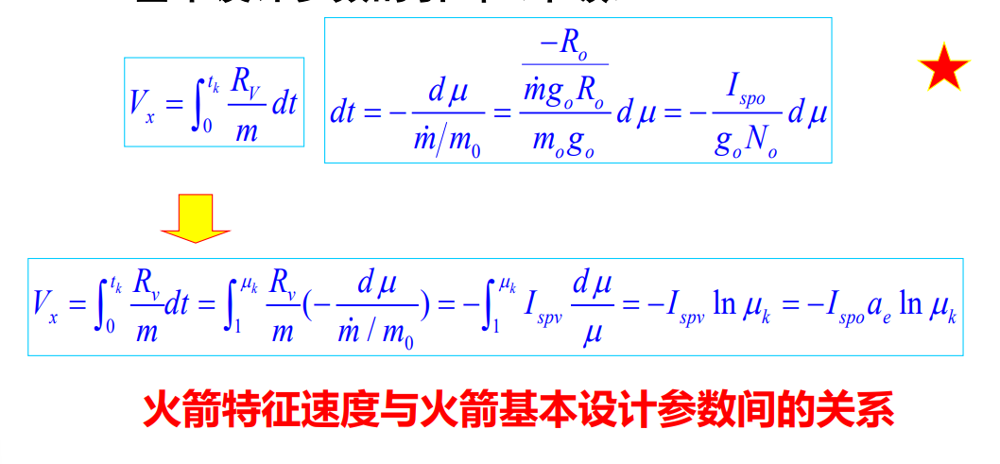

[toc]
# 第一章 绪论
## 导弹
是依靠喷气发动机推进的或做无动力飞行的一种无人驾驶的有控飞行武器
## 导弹武器系统
单独的导弹是不能完成作战任务的，必须有其它系统(或设备)与之配合，并通过一定的连接方式，构成一个完整的体系，才能完成武器的作战使命。
## 总体设计
针对大系统研制而言的技术抓总工作，通过总体设计可使大系统的研制工作任务指标明确，设计方案合理（优选方案），整个研制工作从无序到有序（各系统协调配合），最终使研制出的整体系统成本降低，周期缩短，技术性能最优（效费比最高）
1. 具有很强的背景性
2. 总体设计是一门大系统工程科学
3. 总体设计是一门综合性科学
4. 总体设计是一个从已知设计条件出发创造出新产品的过程

# 第二章 战术技术要求的拟定
## 弹道导弹指标
**`射程`** 命中精度及杀伤概率 生存能力 **`发射准备时间`** 火力机动范围 作战使用条件 首翻期、贮存期
## 影响射程的因素
1. 地球自转
2. 推进剂受环境温度影响
3. 逆、顺风
4. 发射点高程
5. 与作战使用条件有关
## **缩短发射准备时间的途径**
1. 液体-->固体
2. 提高自动化水平
3. 简化发射状态检查及操作程序
4. 提高发射可靠性
5. 全备弹
6. 操作人员素质

# 第三章--气动部分
## 斜吹力矩
导弹以攻角α、侧滑角β飞行时，因气流不对称产生的相对于弹体纵轴的滚动力矩称为斜吹力矩
又称为"诱导滚动力矩"

## 气动布局
导弹弹身上的外露部件（弹翼、舵面、进气道等）的形状、数目确定及其沿弹身周侧和轴向的布置。

## ?静稳定特性
??
## **气动布局的典型布局及特点**
|位置|布局|特点|
|-|-|-|
弹身周侧|一字型|1. 翼面少、质量轻 2. 阻力小、便于载机悬挂 3. 倾斜转弯
弹身周侧|十字型 X字型 |1. 各方向均能产生最大的机动过载、响应快速  2. 翼面多、质量大、阻力大、升阻比低 3. 侧滑转弯、控制系统简单
弹身轴向|正常式|1. 舵面产生的控制力与弹翼产生的升力方向相反  2. 不存在舵面偏转对弹翼引起的下洗，纵向及横滚稳定性好  3. 舵面偏转与攻角相反  4. 升阻比稍低于鸭式 5. 舵面位于弹翼洗流区，舵效率低，舵面积大  6. 舵面差动可同时用作副翼，控制横滚
弹身轴向|鸭式|1. 舵效率高，舵面积小（头部、力臂、下洗）  2. 舵面产生的控制力与弹翼产生的升力方向相同  3. 舵面偏转与攻角相同 4. 升阻比大于正常式 5. 斜吹力矩增大 6. 横向稳定性降低

## 圆公算偏差(ECP)
一批导弹，有50%落入以瞄准点为中心的圆内，该圆的半径即为圆公算偏差（CEP）

# 第三章--动力部分
## 发动机相关参数 性能指标
1. 推力
2. **总冲**:$I=\int_{t_0}^{t_s}P(t)dt$
3. 工作时间
4. **比冲**:消耗1kg推进剂所产生的冲量
5. 发动机高度和速度特性
6. **单位推进剂（燃料）消耗率**
   1. 单位时间燃料消耗量与发动机推力之比值
$\eta=\frac{\dot m_e}{P}=\frac{1}{I_s}$
   2. 它表示为产生1N推力，单位时间内需消耗多少质量的燃料
   3. 发动机工作过程经济性的一个标志
7. 质量比（固体发动机）: 推进剂质量/动力装置质量（含推进剂）
8. 单位迎面推力:
   1. 发动机推力与最大迎风面积之比
   2. 发动机阻力特性
   3. 对吸气式发动机尤为重要
   4. 从空气动力学角度反映出发动机设计的好坏

## 固体火箭和液体火箭的特点分析

# 第三章--制导部分

## **导弹总体对制导系统设计的基本要求**
战术技术指标直接影响制导系统的方案选择,确定及设计，但命中精度是核心问题
制导系统的根本任务：在尽量保证上述条件下，必须保证导弹的命中精度
1. 满足制导精度要求
2. 战术使用灵活
3. 尽可能减少设备的体积、质量及内耗
4. 成本适当
5. 可靠性高、可检测及维护性好

## **复合制导飞行段的特点**
|飞行段|特点|定义|
|-|-|-|
|初制导|飞行时间短 平均速度小 速度变化大|当导弹从发射到加速到正常飞行状态时，发射段弹道散布难以满足中制导要求时（一般指遥控、自寻的制导），要加初制导
|中制导|飞行时间长 飞行空域大|当导弹末制导对目标的截获与稳定跟踪距离及视场无法与导弹射程及作战空域的要求匹配，同时初制导有控弹道散布无法满足末制导启控条件，要采用中制导
|末制导|距离目标近 飞行距离短 需用过载大|综合考虑中制导的体制与能够达到的精度、导弹打击目标的精度要求（目标尺寸、要害、杀伤概率）及导弹成本，确定是否采用末制导

# 第三章--战斗部
## **基本概念**
###  **无条件杀伤半径**
在某个半径范围内，冲击波能确定的摧毁目标
### 毁伤概率
导弹正常发射并飞至预定攻击区域，引信正常工作条件下，战斗部毁伤目标的可能性
###  **威力半径**
对给定目标而言，毁伤概率达到规定值时，杀伤战斗部的破片飞散距离
###  ~~破甲深度（侵彻深度）~~
### ~~TNT当量~~
~~某一爆炸性核弹头爆炸时所释放的能量相当于n吨普通TNT炸药爆炸时释放的能量，那么该爆炸性核弹头的威力为n吨TNT当量~~

## **破片战斗部**
### 破片静态飞散角
战斗部爆炸以后，在战斗部轴线所在的平面内，90%有效破片所占的角度
### 破片静态飞散方向角
破片飞散方向与战斗部轴线正向（即弹轴方向）所成的夹角。由于破片飞散具有一定的张角，因此飞散方向角按张角的中心线计
### ?动态飞散角
??

## ☆引战配合
### `目标毁伤条件`: 
目标的要害部位恰好处于战斗部的破片飞散区
### **`☆引战配合问题`**: 
正确选择引信的起爆时机，使战斗部的实际引爆区与战斗部的有效起爆区协调配合
### 影响引战配合特性的`主要因素`:
   1. 弹目遭遇条件：导弹、目标速度、姿态、交会角、遭遇高度
   2. 目标特性：要害部位尺寸、位置、分布，目标的质心位置、目标辐射、反射特性
   3. 战斗部参数：静态飞散角、飞散方向角、破片大小、质量、初速、密度
   4. 引信性能参数：引信灵敏度、时延、视场、感知距离
### 引战配合的`要求`
   1. 引信实际引爆距离< 战斗部有效杀伤半径
   2. 引信实际引爆区与战斗部有效引爆区之间应协调(在弹目各种预期遭遇条件下，二者配合概率不小于给定值)
   3. 引信实际引爆区中心应力求接近战斗部的最佳起爆点，以获得最佳杀伤效果

## 部位安排
根据导弹（火箭）总体布局，合理安排弹（箭）上部件及仪器的相对位置，是总体设计中一项繁杂而细致的工作
## 串联火箭的分离方案
|名称|特点|定义|
|-|-|-|
热分离|1. 分离过程及机构简单、可靠性好 2. 分离时间短、对下面级影响大|下面级火箭推力尚未消失，上面级点火；当上面级推力达到一定值时，连接解锁，上面级加速，下面级减速，实现级间分离
冷分离|1. 分离系统复杂，分离时间长，级间段小 2. 上面级推进剂无浪费、对下面级无影响|下面级火箭推力已消失，上面级还未启动时，连接解锁，依靠上面级加力火箭和下面级反推火箭实现分离，分离后上面级再点火工作|

## 常规战斗部的对比表格

# 第四章
> 一定有一道简答题 全是文字性的内容,不含公式
## ☆多级导弹（火箭）的优点
1. 多级导弹（火箭）在每级工作结束后可以抛掉不需要的质量，因而在导弹的飞行过程中，能够获得良好的加速性能，逐步达到预定的飞行速度。
2. 多级导弹（火箭）各级发动机是独立工作的，可以按照每一级的飞行条件设计发动机，使发动机处于最佳工作状态，也就提高了导弹的飞行性能。
3. 多级导弹（火箭）可以灵活地选择每一级推力的大小和工作时间，以适应飞行弹道的要求、弹道测量要求以及导弹对飞行过载的要求

# ☆公式推导-1 起飞质量方程的建立
需要写出各个参数的意义
这都是啥gou8玩意啊
1. 
2. 第1条中
3. 第1条中
4. 第3条中
5. 第3条中
6. 第3条中
7. 第2条中
8. 怎么就所以了?
9. 
10. 

# ☆公式推导-2 火箭基本设计参数的引出

如果问的是基本设计参数的引出,还要继续往下写

# 主观开放题
> 试思考`多学科设计优化`、`隐身等先进技术`对导弹总体设计结果有哪些提升；试讨论`作战运用`、`作战效能`对导弹总体设计的影响；试预测未来导弹的`发展趋势`。
总共有五问 都必须回答 严禁雷同 写满一整页 结合实事